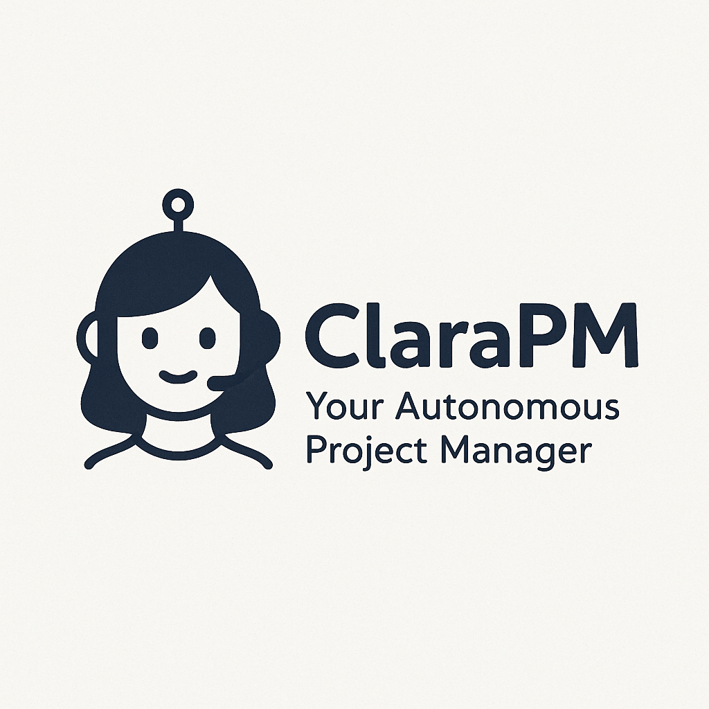

# ClaraPM - Your Autonomous Project Manager



ClaraPM is an AI-powered project management system designed to streamline software development workflows through intelligent task intake and assignment. It combines natural language processing capabilities with rule-based decision-making to automate routine project management tasks.

## System Overview

ClaraPM consists of two primary modules:

1. **Intake Agent** - Processes natural language requests and conversations to create structured task specifications
2. **Assignment Agent** - Intelligently assigns tasks to developers based on workload, skills, and availability

## Getting Started

### Prerequisites

- Python 3.8+
- SQLite
- pip

### Installation

1. Clone the repository
```bash
git clone https://github.com/yourusername/claraPM.git
cd claraPM
```

2. Install dependencies
```bash
pip install -r requirements.txt
```

3. Initialize the database
```bash
python reset_db.py
```

## Running ClaraPM

### Running the Intake Agent

The Intake Agent processes natural language requests and converts them into structured task specifications.

```bash
python run.py
```

The Intake API will be available at http://localhost:8000, with interactive documentation at http://localhost:8000/docs.

### Running the Assignment Agent

The Assignment Agent handles task distribution and developer allocation.

```bash
python run_assignment_agent.py
```

The Assignment API will be available at http://localhost:8001, with interactive documentation at http://localhost:8001/docs.

## Database Management

ClaraPM uses SQLite for data storage:

### Database Structure

- **Users**: Authentication and user profiles
- **Tasks**: Project tasks with descriptions and requirements
- **Assignments**: Links between tasks and developers
- **ConversationSessions**: User conversation sessions
- **Messages**: Individual messages within conversation sessions

### Initializing the Database

To reset the database and populate it with default data:

```bash
python reset_db.py
```

This creates:
- Default admin and user accounts
- Sample tasks
- Sample conversation sessions

### Adding Data Manually

You can add data through:

1. The API endpoints
2. Direct database access using SQLite
```bash
sqlite3 clara_pm.db
```

3. Using the Python interface:
```python
from shared.models import SessionLocal, create_user, create_task
from datetime import datetime

db = SessionLocal()
new_user = create_user(db, "username", "email@example.com", "password", "Full Name", "developer")
new_task = create_task(db, "Task Title", "Description", new_user.id, 1, "Medium", "Developer", datetime(2023, 12, 31), "admin")
```

## System Use Case and Rationale

ClaraPM was developed to address several key challenges in software project management:

1. **Reducing PM Overhead**: Automating routine project management tasks like task creation and assignment frees PMs to focus on strategic initiatives
2. **Standardizing Task Specifications**: Natural language processing creates consistent, structured task specs regardless of how they're initially described
3. **Optimizing Resource Allocation**: Intelligent assignment balances workloads and matches developer skills to task requirements
4. **Improving Visibility**: Centralized tracking of tasks, assignments, and communications

The system is particularly valuable for teams that:
- Work remotely or asynchronously
- Have variable workloads and resource availability
- Need to quickly onboard new team members
- Want to reduce context switching for developers

## Governance Rules

ClaraPM implements several governance rules to ensure fair, efficient, and transparent project management:

1. **Assignment Fairness**:
   - Tasks are distributed to minimize workload imbalance
   - Developer skills and experience are matched to task requirements
   - Workload history is considered in new assignments

2. **Security and Access Control**:
   - Role-based permissions (admin, user, developer)
   - Authentication required for all operations
   - Audit logging of all system actions

3. **Decision Transparency**:
   - All agent decisions are logged with explanations
   - Assignment decisions can be reviewed and overridden
   - Agents provide reasoning for recommendations

4. **Data Integrity**:
   - Structured validation of all inputs
   - Consistent data models across modules
   - Database transactions ensure atomicity

## Architectural Tradeoffs and Constraints

### Architecture Decisions

1. **Modular Design**: Separating intake and assignment functions allows independent scaling and development but introduces coordination complexity
2. **FastAPI Framework**: Chosen for performance, modern Python support, and built-in API documentation
3. **SQLite Database**: Selected for simplicity and ease of setup, with the tradeoff of limited concurrency
4. **AI Integration**: LLMs provide flexibility in handling natural language but increase computational requirements and system complexity

### Constraints

1. **Performance**:
   - LLM inference time affects response latency
   - SQLite limits concurrent write operations

2. **Scalability**:
   - Current architecture supports small to medium teams
   - Would require database migration for large-scale deployment

3. **Deployment**:
   - Requires secure management of API keys
   - LLM integration requires internet connectivity

4. **Integration**:
   - APIs support external system integration
   - Webhook capabilities are limited in the current version

### Future Architectural Considerations

1. Database migration to PostgreSQL for improved concurrency
2. Microservice architecture for enhanced scalability
3. Cache implementation to reduce LLM calls for common queries
4. Support for multiple LLM backends to reduce vendor dependency

## API Endpoints

### Intake Agent

- `/token` - Get authentication token
- `/users/me` - Get current user info
- `/intake/query` - Submit a query to the AI agent
- `/intake/sessions` - List user sessions
- `/intake/sessions/{session_id}` - Get, update, or delete a specific session

### Assignment Agent

- `/assign/intelligent` - Intelligently assign a task to a developer
- `/assign/intelligent/batch` - Assign all unassigned tasks intelligently

## Testing

Run all tests:
```bash
python tests/run_tests.py
```

Or run a specific test:
```bash
python -m pytest tests/test_logger_unit.py -v
``` 